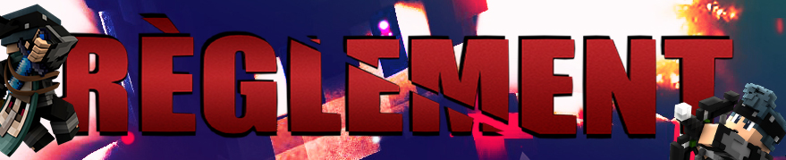

# ✨ Règlement sur le discord 

<figure><figcaption></figcaption></figure>


┕ •┠|Règlement Overky|┕•â”

Bienvenue sur le Discord de Overky\
Les différentes règles à respecter sur notre Discord Les insultes, provocations, le racisme, l'homophobie, le harcèlement, les discours haineux, la divulgation d'informations personnelles sont interdites, merci de respecter les autres joueurs. La publicité est totalement interdite, les seules exceptions autorisées sont les Discord de factions jouant sur Overky et les Jouer qui ont le grade Youtubeur Le spam, le flood de quelque forme qu'il soit est interdit. Il est formellement interdit de mentionner les administrateurs.  Règlement du serveur de jeu Minecraft  [https://overky.fun/p/reglement](https://overky.fun/p/reglement)Tickets En cas de question ou problème merci de faire un ticket  sur le discord ou le site web.

